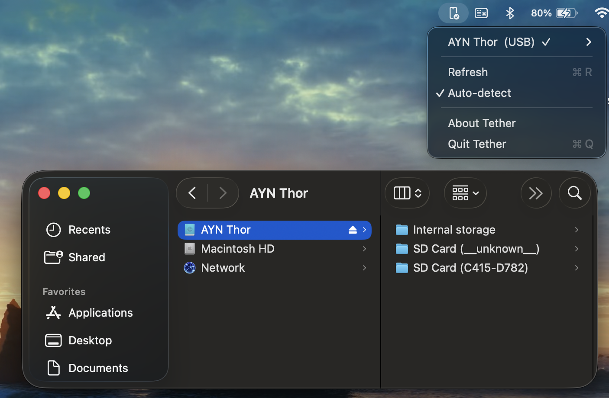

<h1 align="center">Tether</h1>

<p align="center">Mount your Android in Finder — over USB or WiFi, no kernel extensions.</p>

<p align="center">
  
  
  
  <a href="LICENSE"></a>
</p>

A tiny macOS menu-bar app that mounts your Android device's filesystem into
Finder over ADB — USB or WiFi. No kernel extension, no third-party mounting
software, nothing to install on the phone beyond USB debugging.

<p align="center">
  
</p>

- Lives in the menu bar; auto-detects connected devices.
- One click to **mount** a device and browse it in Finder; one click to unmount.
- See **every storage volume** — internal storage *and* removable SD / USB cards.
- Periodic auto-detect plus a manual **Refresh**.
- Read, write, and delete files directly in Finder.
- Unmounts cleanly on quit, kill, or crash — never leaves a broken volume behind.

## Install

Grab the latest signed & notarized DMG from the
[**Releases page**](https://github.com/pmsosa/tether/releases/latest),
open it, and drag **Tether** into Applications. Because it's Developer-ID
signed and notarized by Apple, it runs without any Gatekeeper warnings.

## How it works

Tether runs a small in-app WebDAV server backed by `adb`, and mounts it with
macOS's built-in `/sbin/mount_webdav`. That gives a real, live Finder volume
using only software that already ships with macOS. See [DESIGN.md](DESIGN.md)
for the full design and the mount-engine trade-offs.

## Requirements

- macOS 26+
- [`adb`](https://developer.android.com/tools/adb) (Android platform-tools).
  Install with: `brew install --cask android-platform-tools`
- On the phone: **USB debugging** enabled, and the Mac authorized (accept the
  on-device prompt).

## Build & run

```sh
./build.sh --dev      # build and run locally
./build.sh            # build an unsigned DMG (local testing)
./build.sh --sign     # build a signed + notarized DMG (needs Apple creds)
./build.sh --help     # all options
```

Tether is **not** distributed via the Mac App Store: it spawns `adb` and
`mount_webdav`, which the App Store sandbox forbids. Instead it ships as a
Developer-ID-signed, notarized DMG — see [Install](#install) above to download it.

## License

BSD-3-Clause — see [LICENSE](LICENSE). Made by [Pedro M. Sosa](https://konukoii.com).
